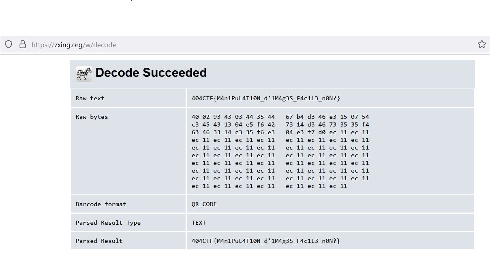

**Objectif :** Dans ce challenge il y a un ensemble d'images qui peuvent faire penser à un QR-code ou un Data-Matrix en pièces détachées.

Comme il s'agit d'un carré, on compte combien il y a d'images : 24 * 24, chacune de largeur de 33 pixels.

On construit une image de 24 * 33 de large et de 24 * 33 de haut.

On balaie ligne par ligne puis colonne jusqu'à la dernière image!

Une fois agrégée, l'image correspond à un QR Code pouvant être visualisée par exemple avec le téléphone. 

Voir la solution.
